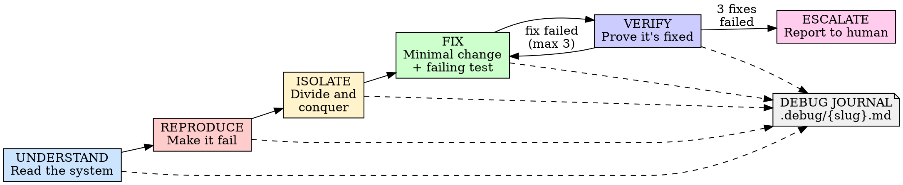

# Debugging

## Overview

Find the root cause. Prove it. Then fix it.

**Core principle:** If you can't explain why the bug happens, you don't know if your fix is correct.

**Violating the letter of the rules is violating the spirit of the rules.**

## When to Use

**Always:**
- Test failures
- Unexpected behavior
- Error messages
- Regressions
- "It works on my machine" situations

**Exceptions (ask your human partner):**
- Typos and obvious one-character fixes
- Configuration value changes with known correct values

Thinking "I already know the fix"? Stop. That's guessing, not debugging.

## The Iron Law

```
NO CODE CHANGES UNTIL YOU CAN EXPLAIN THE ROOT CAUSE
```

Think you know the fix? Prove the root cause first. Then fix.

**No exceptions:**
- Don't "try a quick fix to see if it works"
- Don't change multiple things hoping one helps
- Don't fix symptoms instead of causes
- Don't skip reproduction because "it's obvious"

Understand first. Fix second. Period.

## Five-Phase Workflow



## Phase 1: UNDERSTAND

Read the system. Check your assumptions. Don't touch anything yet.

Before investigating the bug, understand the code it lives in. Your mental model is a hypothesis — treat it as one.

**Required steps:**
1. Read the relevant source files end-to-end (not just the failing line)
2. Trace the code path from input to failure
3. Identify what the code *should* do vs. what it *does*
4. Check the obvious: dependencies installed? correct branch? config valid? environment correct?
5. Read error messages completely — stack traces, line numbers, all of it
6. Use git to fetch recent changes
7. For multi-component systems (API → service → database, CI → build → deploy), instrument at each boundary *before* forming hypotheses. Run once, collect evidence from every layer, then analyze where the chain breaks.

**Example — multi-layer instrumentation:**
```
System: Frontend → API Gateway → Auth Service → Database
Step 1: Add logging at each boundary (request in, response out)
Step 2: Trigger the failure once
Step 3: Read the logs layer by layer:
  - Frontend sent correct request ✓
  - API Gateway forwarded correctly ✓
  - Auth Service received request ✓
  - Auth Service → Database query returned empty result ✗
  - Auth Service returned 500 to Gateway
Conclusion: Problem is between Auth Service and Database.
Now investigate that specific boundary.
```
Don't guess which layer is broken. Let the evidence from all layers tell you.

<Good>
```
Read the full function. Trace the call chain from the API endpoint
through the service layer to the database query. Found that
`getUserById` is called with a string ID but the query expects
an integer. The type mismatch happens at the controller layer.
```
Reads the system, traces the path, identifies the discrepancy
</Good>

<Bad>
```
The error says "invalid input" so I'll add input validation
to the endpoint.
```
Didn't read the code, didn't trace the path, guessed at a fix
</Bad>

**Check the plug:**
- Is the service running?
- Is the database connected?
- Are environment variables set?
- Is the right version deployed?
- Did a dependency update break something?

Don't assume the obvious is fine. Verify it.

## Phase 2: REPRODUCE

Make it fail. Consistently. On demand.

If you can't reproduce it, you can't prove you fixed it. Observation before theory — watch what actually happens, don't theorize about what might happen.

**Required steps:**
1. Create a minimal reproduction (smallest input that triggers the bug)
2. Run it. Watch it fail. Note the exact output.
3. Run it again. Confirm it fails the same way.
4. Add instrumentation (logging, breakpoints) if the failure path is unclear
5. Document the reproduction steps in the debug journal

**Reproduction checklist:**
- [ ] Can trigger the bug on demand
- [ ] Same failure every time (or documented intermittent pattern)
- [ ] Minimal reproduction — removed everything not needed to trigger it
- [ ] Exact error output recorded

**Can't reproduce?**
- Check environment differences
- Check timing/race conditions
- Check data-dependent paths
- Add logging and wait for it to recur
- Don't guess. If you can't reproduce it, you can't fix it.

## Phase 3: ISOLATE

Narrow the search space. One variable at a time.

Form hypotheses. Make them falsifiable. Test them. Eliminate possibilities systematically — don't jump to conclusions.

**Required steps:**
1. Form a specific, falsifiable hypothesis: "The bug occurs because X. If I do Y, I should see Z."
2. Test the hypothesis. One change at a time.
3. Record the result: confirmed or eliminated.
4. Repeat until the root cause is isolated.

### Investigation Techniques

| Technique | When to Use | How |
|-----------|-------------|-----|
| **Binary search** | Large code path, unknown location | Comment out half the code path. Bug gone? It's in that half. Repeat. |
| **Differential debugging** | Worked before, broken now | Compare working vs. broken state. `git bisect`, diff configs, diff dependencies. |
| **Minimal reproduction** | Complex system, many variables | Strip away components until the simplest case that still fails. |
| **Working backwards** | Clear error, unclear cause | Start at the error. Trace backwards through the call chain. |
| **Rubber duck** | Stuck, circular thinking | Explain the bug out loud, step by step. The gap in your explanation is the gap in your understanding. |

**One thing at a time:**
- Change one variable per test
- Revert changes that didn't help
- Don't combine hypotheses ("maybe it's A and B together")
- If you changed two things and it worked, you don't know which one fixed it

<Good>
```
Hypothesis: The timeout occurs because the connection pool is exhausted.
Test: Log active connections before the failing request.
Result: 50/50 connections active. Confirmed — pool exhaustion.
Next: Why aren't connections being released?
```
Falsifiable hypothesis, tested, confirmed, asks next question
</Good>

<Bad>
```
Might be a timeout issue. Let me increase the timeout to 30s.
Also bump the connection pool to 100. And add a retry.
```
Three changes at once, no hypothesis, no understanding
</Bad>

## Phase 4: FIX

State the root cause. Write a failing test. Make the minimal fix.

You've isolated the root cause. Now prove it with a test, then fix it.

**Required steps:**
1. **State the root cause** — Write it in the debug journal with a verification level (see Verification Levels below)
2. **Write a failing test** — Invoke `Skill(skill="groundwork:test-driven-development")` and follow the TDD cycle. The test must reproduce the exact bug.
3. **Minimal fix only** — Change the least amount of code to fix the root cause. Don't refactor. Don't "improve" nearby code. Don't fix other bugs you noticed.
4. **One change at a time** — If the fix requires multiple changes, make them incrementally.

<Good>
```
Root cause: getUserById passes string ID to SQL query that
expects integer. Connection pool exhaustion is a symptom —
queries hang waiting for type coercion timeout.

Fix: Parse ID to integer at the controller layer before
passing to the service.
```
Root cause stated, explains the symptom chain, minimal targeted fix
</Good>

<Bad>
```
Fixed the timeout by:
- Increasing pool size to 200
- Adding parseInt to 5 different endpoints
- Refactoring the connection manager
- Adding retry logic to all database calls
```
Shotgun fix, no root cause stated, changes way beyond the bug
</Bad>

## Phase 5: VERIFY

Prove the fix works. Prove nothing else broke. Get a fresh perspective.

**Required steps:**
1. Run the failing test — it must pass now
2. Run the full test suite — nothing else broke
3. Re-run the original reproduction — the bug is gone
4. Review your fix with fresh eyes — does it actually address the root cause, or mask it?
5. Check for related code paths — could the same bug exist elsewhere?

**Verification checklist:**
- [ ] Failing test now passes
- [ ] Full test suite passes
- [ ] Original reproduction no longer triggers the bug
- [ ] Fix addresses root cause (not symptoms)
- [ ] No unrelated changes included
- [ ] Related code paths checked for same bug

**Fix didn't work?** Go back to Phase 3. Your root cause analysis was wrong. Don't patch the patch — re-investigate.

## Escalation Rules

**3-fix limit.** If your third fix attempt fails, stop and escalate.

Three failed fixes means your root cause analysis is wrong. More attempts won't help — you need a different perspective.

**Question the architecture.** Three failed fixes often signal something deeper than an incomplete investigation. The bug may exist because the design is fundamentally unsound — a race condition baked into the concurrency model, a data integrity problem caused by a missing constraint, a failure mode that the architecture doesn't account for. When you escalate, shift the question from "help me fix this bug" to "is this design sound?"

**Escalation output format:**

```markdown
## Escalation: [Bug Description]

### What I tried

| # | Hypothesis | Fix Attempted | Result |
|---|-----------|---------------|--------|
| 1 | [hypothesis] | [what you changed] | [what happened] |
| 2 | [hypothesis] | [what you changed] | [what happened] |
| 3 | [hypothesis] | [what you changed] | [what happened] |

### Eliminated hypotheses
- [hypothesis]: eliminated because [evidence]

### What I know
- [confirmed fact with evidence]

### Could this be architectural?
[If 3 fixes failed, consider whether the bug reflects a design problem, not just a code problem. What assumption does the current architecture make that might be wrong?]

### Recommended next step
[specific suggestion for the human partner]
```

Revert all failed fix attempts. Leave the codebase clean.

## Debug Journal

Maintain a persistent debug file at `.debug/{slug}.md`. This survives context compaction and provides continuity across sessions.

**Create the `.debug/` directory and file at the start of Phase 1.**

```markdown
# Debug: {slug}

## Status
[Active | Root Cause Found | Fixed | Escalated]

## Symptoms
- [What the user or test reported]
- [Exact error messages]
- [When it started / what changed]

## Reproduction
[Minimal steps to trigger the bug]
[Command to run]
[Expected vs. actual output]

## Hypotheses

### Active
- [ ] [Hypothesis]: [How to test it]

### Eliminated
- [x] [Hypothesis]: Eliminated because [evidence]

## Evidence Log
| # | Action | Observation | Conclusion |
|---|--------|-------------|------------|
| 1 | [what you did] | [what happened] | [what it means] |

## Root Cause
**Verification level:** [Verified | Corroborated | Unverified]

[Root cause statement]

[Evidence that confirms it]

## Fix
[What was changed and why]

## Resolution
[Final status, test references, PR link]
```

**Update the journal as you work.** Every hypothesis, every test, every result goes in the journal. When context compacts, the journal remains.

## Verification Levels

Root cause claims require a confidence level. This prevents false confidence and forces honest assessment.

| Level | Meaning | Required Before Fix? |
|-------|---------|---------------------|
| **Verified** | Root cause proven by direct evidence (test reproduces it, fix resolves it, revert re-introduces it) | Yes — proceed to fix |
| **Corroborated** | Multiple independent observations support it, but no single definitive proof | Yes — proceed to fix with extra caution |
| **Unverified** | Single observation or logical inference only | No — gather more evidence first |
| **Contradicted** | Evidence conflicts with the hypothesis | No — eliminate this hypothesis |

**Rule: Never fix based on an unverified root cause.** If your confidence is "unverified," you're guessing. Go back to Phase 3.

## Common Rationalizations

| Excuse | Reality |
|--------|---------|
| "I already know the fix" | Then prove the root cause first. Takes 2 minutes if you're right. |
| "Let me just try this quick fix" | Quick fixes become permanent. Understand first. |
| "The fix is obvious" | Obvious fixes for wrong root causes create new bugs. |
| "I'll investigate after I fix it" | You won't. And you can't verify a fix you don't understand. |
| "It's just a typo / off-by-one" | Verify. "Just a typo" has been wrong more times than right. |
| "I changed 3 things and it works now" | You don't know which one fixed it. Revert two. |
| "Reproducing is too hard, let me just fix it" | If you can't reproduce it, you can't verify the fix. |
| "I don't need a journal for something this simple" | Simple bugs that need journals are the ones that spiral. |
| "The tests pass, so it's fixed" | Tests pass ≠ root cause addressed. The symptom might be masked. |
| "Let me add a retry / increase the timeout" | That's masking, not fixing. Find why it fails. |
| "It works on my machine" | Then your machine isn't the one with the bug. Reproduce there. |
| "I've been debugging this for hours, let me just ship it" | Sunk cost. Escalate instead of shipping a guess. |

## Signals From Your Human Partner

During interactive debugging, your human partner's reactions are a signal channel. Frustration and redirection mean your process is off — not that the human is being difficult.

| What they say | What it means | What to do |
|---------------|---------------|------------|
| "Is that not happening?" | You assumed something without verifying | Go back and verify with evidence |
| "Stop guessing" | You're proposing fixes without understanding | Return to Phase 1 — read the system |
| "We're going in circles" / frustrated tone | Your approach isn't working | Step back. Re-read from scratch. Your mental model is wrong. |
| "Did you actually check?" | You claimed something without evidence | Gather evidence first, then report what you found |
| "That's not the problem" | You're investigating the wrong thing | Ask what they're seeing. Their context is broader than yours. |
| "Just revert" | Your fixes are making things worse | Revert everything. Return to Phase 2 with a clean slate. |

**Rule:** Treat pushback as data, not criticism. If your human partner redirects you, the most productive response is to follow the redirect — not to defend your hypothesis.

## Red Flags — STOP and Go Back to Phase 1

- Changing code without stating the root cause
- Multiple changes at once ("let me try a few things")
- Fix attempt #4+
- "I think it might be..." without a falsifiable test
- Increasing timeouts, pool sizes, or retry counts as a "fix"
- Adding error suppression (empty catch blocks, silent fallbacks)
- Can't explain why the fix works
- Fix is larger than the bug warrants
- Fixing a different bug than the one you started with
- No reproduction case
- No failing test
- Skipping the debug journal

**All of these mean: Stop. Go back to Phase 1. Understand the system.**

## When Stuck

| Problem | Solution |
|---------|----------|
| Can't reproduce | Check environment, timing, data. Add logging. Wait for recurrence. |
| Hypothesis keeps being wrong | Step back. Re-read the code from scratch. Your mental model is wrong. |
| Fix works but don't understand why | Revert. That's not a fix, it's an accident. Investigate why it works. |
| Too many variables | Simplify. Remove components until you find the minimal failing case. |
| Intermittent failure | Add instrumentation. Look for race conditions, timing, external state. |
| Stuck in a loop | Rubber duck. Explain the bug step by step. The gap is the clue. |
| Bug disappeared | It's hiding. Check if something else changed. Don't declare victory. |
| Fix breaks other tests | Your fix is wrong, or the other tests reveal a deeper issue. Investigate. |

## When Investigation Finds No Root Cause

Sometimes systematic investigation legitimately concludes without a clear root cause — environmental issues, timing-dependent failures, external service flakiness, or bugs that disappear under observation. This is rare, but it happens.

**When you genuinely cannot identify the root cause:**

1. **Document what was investigated and eliminated.** Every hypothesis tested, every result observed. This prevents the next investigator from repeating your work.
2. **Implement appropriate handling.** Retry logic, timeouts, clearer error messages, or monitoring — not as a "fix," but as resilience for a known-unknown failure mode. Be explicit that this is mitigation, not a root cause fix.
3. **Add instrumentation for recurrence.** Logging, metrics, or alerts that will capture more data when the failure happens again. Design the instrumentation to answer the specific questions you couldn't answer this time.
4. **Record in the debug journal with status "Inconclusive."** Include what you know, what you don't, and what data would resolve it.
5. **Communicate honestly.** Tell your human partner what you investigated, what you eliminated, and that you couldn't pin it down — not a vague "it should be fine now."

**Caveat:** 95% of "no root cause found" conclusions are actually incomplete investigations. Before declaring inconclusive, honestly assess:
- Did you complete all five phases?
- Did you actually reproduce the failure, or just read the code?
- Did you test falsifiable hypotheses, or just form opinions?
- Is the journal thorough, or are there gaps?

If there are gaps, go back and fill them. "Inconclusive" is a legitimate outcome — but only after exhausting the process, not instead of it.

## Example: Full Walkthrough

**Bug report:** "API returns 500 on user profile page for some users"

### Phase 1: UNDERSTAND

Read the profile endpoint handler, the user service, and the database query. The endpoint calls `getUserProfile(id)` which joins `users` and `preferences` tables.

Check the plug: database connected, service running, other endpoints working fine.

### Phase 2: REPRODUCE

```bash
curl -s localhost:3000/api/profile/42   # 200 OK
curl -s localhost:3000/api/profile/107  # 500 Internal Server Error
```

Consistent. User 42 works, user 107 fails. Minimal reproduction found.

Error log: `TypeError: Cannot read property 'theme' of null`

### Phase 3: ISOLATE

**Hypothesis 1:** User 107 has a null `preferences` record.
**Test:** Query the database directly.
```sql
SELECT * FROM preferences WHERE user_id = 107;
-- Empty result set
```
**Result:** Confirmed — user 107 has no preferences row.

**Hypothesis 2:** The JOIN returns null for preferences, and the code doesn't handle it.
**Test:** Read `getUserProfile` — it does `user.preferences.theme` with no null check.
**Result:** Confirmed. The LEFT JOIN returns null preferences, and the code assumes it exists.

**Root cause:** `getUserProfile` accesses `preferences.theme` without null-checking the join result. Users without a preferences row trigger a TypeError.

**Verification level:** Verified (direct evidence: null row + no null check + exact error match).

### Phase 4: FIX

**Failing test:**
```typescript
test('returns default theme when user has no preferences', async () => {
  const user = await createUser({ id: 999 }); // no preferences row
  const profile = await getUserProfile(999);
  expect(profile.theme).toBe('default');
});
```

Test fails with `TypeError: Cannot read property 'theme' of null`. Correct failure.

**Fix:**
```typescript
const theme = user.preferences?.theme ?? 'default';
```

Test passes.

### Phase 5: VERIFY

- [ ] Failing test passes: yes
- [ ] Full test suite: all green
- [ ] `curl localhost:3000/api/profile/107`: 200 OK, theme is "default"
- [ ] Fix addresses root cause: null preferences handled
- [ ] Checked other code paths: `preferences.language` has same bug — filed separate issue

Done.

## Final Rule

```
Root cause identified → Fix with failing test → Verify fix
Otherwise → not debugging, just guessing
```

No exceptions without your human partner's permission.
