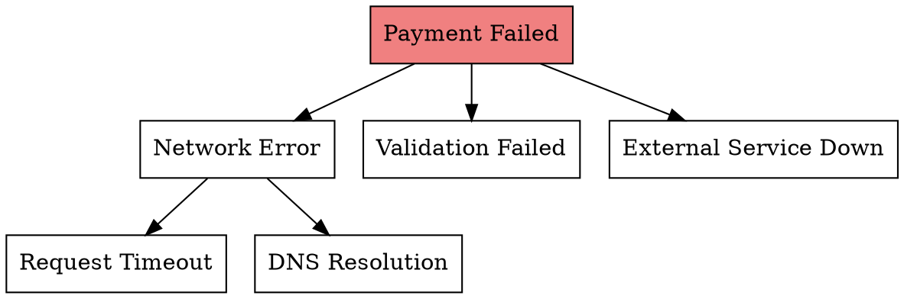

# Root Cause Tracing

## Overview

Bugs manifest where symptoms appear, not where causes originate. Quick patches at symptom locations create a pattern of recurring issues and layered workarounds.

**Core principle:** Trace backward from symptom to source. Fix at the source, not where the error appears.

## When to Use

Use when:
- Symptom clear, cause hidden
- Error deep in call stack
- Same bug keeps returning after fixes
- Fix in one place breaks something else
- You're adding workarounds instead of solutions

## The 5 Whys Technique

**Simple but powerful:** Keep asking "Why?" until you reach the root cause.

```
1. WHY did the build fail?
   → Missing dependency

2. WHY is the dependency missing?
   → It was removed from package.json

3. WHY was it removed?
   → Appeared unused in code analysis

4. WHY did analysis miss it?
   → Dynamic import not detected by static analysis

5. WHY use dynamic import?
   → ROOT CAUSE: Conditional loading pattern without proper documentation
```

**Rule:** 5 is a guideline, not a limit. Stop when you find something you can fix at the source.

## Backward Tracing Through Call Stack

### 1. Start at Symptom
```
Error: Cannot read property 'id' of undefined
  at UserService.getProfile (user-service.ts:45)
```

### 2. Trace One Level Up
```typescript
// user-service.ts:45
async getProfile(user: User) {
  return this.db.find(user.id);  // user is undefined
}
```

### 3. Find Caller
```typescript
// auth-controller.ts:23
const profile = await userService.getProfile(req.user);  // req.user undefined
```

### 4. Keep Tracing
```typescript
// auth-middleware.ts:15
req.user = await validateToken(token);  // Returns undefined on invalid token
```

### 5. Find Root Cause
```typescript
// auth-middleware.ts:8
const token = req.headers.authorization;  // Missing 'Bearer ' prefix stripping
```

**Fix at source:** Strip prefix before validation, not check for undefined downstream.

## Binary Search for Root Cause

When you have many potential causes:

```
1. List all possible causes (10 items)
2. Test the middle item (#5)
3. If before #5, search 1-4
   If after #5, search 6-10
4. Repeat until found
```

**Example with git bisect:**
```bash
git bisect start
git bisect bad HEAD          # Current commit is broken
git bisect good v1.2.0       # Last known working version
# Git checks out middle commit - test it
git bisect good/bad          # Mark and continue
```

## Timeline Reconstruction

When bugs are intermittent or timing-related:

```
TIME     EVENT                    STATE
------   ----------------------   ----------------
00:00    User clicks submit       Form valid
00:01    Validation starts        Async running
00:02    User modifies field      Form now invalid
00:03    Validation completes     Returns "valid" (stale)
00:04    Submit proceeds          With invalid data ← BUG
```

**Root cause:** Validation doesn't lock form or revalidate after completion.

## Fault Tree Analysis

Work backward from failure to all possible causes:



**Process:**
1. Start with the failure
2. List immediate possible causes
3. For each cause, list its possible causes
4. Trace until you find actual root cause
5. Fix at the deepest actionable level

## Adding Diagnostic Instrumentation

When manual tracing is insufficient:

```typescript
async function riskyOperation(input: unknown) {
  console.error('DEBUG riskyOperation:', {
    input,
    inputType: typeof input,
    stack: new Error().stack,
    timestamp: Date.now(),
  });

  // Original operation
}
```

**Run and capture:**
```bash
npm test 2>&1 | grep 'DEBUG riskyOperation'
```

## Common Mistakes

| Mistake | Why It's Wrong | Do This Instead |
|---------|----------------|-----------------|
| Fix at symptom | Cause still exists | Trace to source |
| Stop at first "why" | Shallow fix | Ask 5 whys |
| Guess the cause | Waste time on wrong path | Add instrumentation |
| Remove workarounds immediately | May mask other issues | Fix root, then remove |

## Quick Reference

| Technique | When to Use |
|-----------|-------------|
| **5 Whys** | Simple cause-effect chains |
| **Backward Trace** | Deep call stacks |
| **Binary Search** | Many potential causes |
| **Timeline** | Timing/race conditions |
| **Fault Tree** | Complex system failures |

## Related Skills

- **test-driven-development** - Write tests to verify fix and prevent regression
