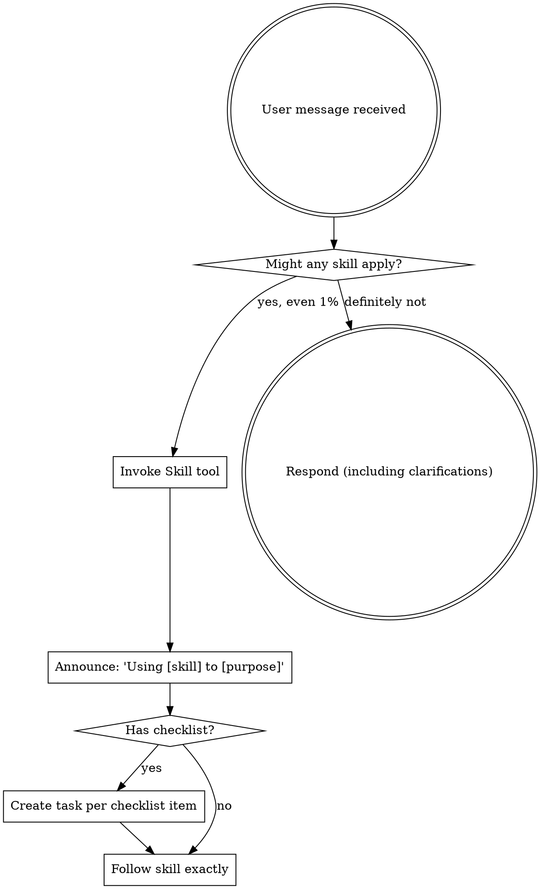

<EXTREMELY-IMPORTANT>
If you think there is even a 1% chance a skill might apply to what you are doing, you ABSOLUTELY MUST invoke the skill.

IF A SKILL APPLIES TO YOUR TASK, YOU DO NOT HAVE A CHOICE. YOU MUST USE IT.

This is not negotiable. This is not optional. You cannot rationalize your way out of this.
</EXTREMELY-IMPORTANT>

## How to Access Skills

**In Claude Code:** Use the `Skill` tool. When you invoke a skill, its content is loaded and presented to you—follow it directly. Never use the Read tool on skill files.

**In other environments:** Check your platform's documentation for how skills are loaded.

# Using Skills

## The Rule

**Invoke relevant or requested skills BEFORE any response or action.** Even a 1% chance a skill might apply means that you should invoke the skill to check. If an invoked skill turns out to be wrong for the situation, you don't need to use it.

## Red Flags

These thoughts mean STOP—you're rationalizing:

| Thought | Reality |
|---------|---------|
| "This is just a simple question" | Questions are tasks. Check for skills. |
| "I need more context first" | Skill check comes BEFORE clarifying questions. |
| "Let me explore the codebase first" | Skills tell you HOW to explore. Check first. |
| "I can check git/files quickly" | Files lack conversation context. Check for skills. |
| "Let me gather information first" | Skills tell you HOW to gather information. |
| "This doesn't need a formal skill" | If a skill exists, use it. |
| "I remember this skill" | Skills evolve. Read current version. |
| "This doesn't count as a task" | Action = task. Check for skills. |
| "The skill is overkill" | Simple things become complex. Use it. |
| "I'll just do this one thing first" | Check BEFORE doing anything. |
| "This feels productive" | Undisciplined action wastes time. Skills prevent this. |
| "I know what that means" | Knowing the concept ≠ using the skill. Invoke it. |
| "I'll just start working on the task" | Task execution REQUIRES the execute-task skill. Invoke it first. |
| "Let me implement this task" | Always invoke execute-task skill - it handles worktree isolation. |

## Skill Priority

When multiple skills could apply, use this order:

1. **Process skills first** (product-design, architecture) - these determine HOW to approach the task
2. **Implementation skills second** (tasks, test-driven-development) - these guide execution

"Let's build X" -> product-design first, then implementation skills.

## Skill Types

**Rigid** (follow exactly, don't adapt away discipline):
- `test-driven-development` - Red-green-refactor cycle
- `execute-task`, `next-task` - Task execution with worktree isolation
- `verify`, `check-alignment`, `validation-loop` - Verification workflows

**Flexible** (adapt principles to context):
- `product-design`, `architecture` - Design approaches
- `tasks` - Task generation

The skill itself tells you which type it is.

## User Instructions

Instructions say WHAT, not HOW. "Add X" or "Fix Y" doesn't mean skip workflows.

## Available Skills

### Design Phase

| Skill | Purpose |
|-------|---------|
| `product-design` | Create detailed PRD with EARS requirements |
| `architecture` | Design system architecture with decisions and tradeoffs |

### Development Phase

| Skill | Purpose |
|-------|---------|
| `test-driven-development` | Red-green-refactor TDD workflow |
| `tasks` | Generate implementation tasks from specs |
| `execute-task` / `/task N` | Work on specific task by number |
| `next-task` | Execute next uncompleted task |
| `use-git-worktree` | Create isolated worktrees for task execution |

### Verification Phase

| Skill | Purpose |
|-------|---------|
| `verify` | Quick verification checkpoint |
| `check-alignment` | Comprehensive code-to-spec alignment audit |
| `validation-loop` | Multi-agent autonomous verification |

### Maintenance Phase

| Skill | Purpose |
|-------|---------|
| `sync-specs` | Keep PRD synchronized with implementation changes |
| `sync-architecture` | Keep architecture synchronized with code changes |

### Meta

| Skill | Purpose |
|-------|---------|
| `using-groundwork` | How to use skills (this skill) |

## Available Agents

These specialized agents are used by the `validation-loop` skill for multi-agent verification:

| Agent | Purpose |
|-------|---------|
| `code-quality-reviewer` | Review code for readability, elegance, and test coverage |
| `security-reviewer` | Check for OWASP Top 10 and security vulnerabilities |
| `spec-alignment-checker` | Verify implementation matches task and EARS requirements |
| `architecture-alignment-checker` | Ensure code follows architecture decisions |

Agents are launched automatically by `/validate` - you don't invoke them directly.

## Verification Hierarchy

Choose the right verification skill based on your needs:

| Skill | When to Use | Depth |
|-------|-------------|-------|
| `verify` | Before marking a task complete | Quick sanity check |
| `check-alignment` | Full audit of spec-to-code alignment | Comprehensive review |
| `validation-loop` | Before PRs or after major changes | Multi-agent thorough review |

**Quick rule:** `verify` for speed, `check-alignment` for accuracy, `validation-loop` for confidence.

**Commands:**
- `/verify` - Quick verification
- `/check-alignment` - Comprehensive audit
- `/validate` - Multi-agent verification (invokes validation-loop)

## Task Execution Patterns

Three ways to execute implementation tasks:

| Command | Behavior | Use When |
|---------|----------|----------|
| `/task N` | Execute single task by number | Working on specific task |
| `/next-task` | Execute next available task | Sequential task work |
| `/just-do-it` | Batch execute all remaining tasks | Autonomous completion |

**Workflow progression:**
1. `/tasks` - Generate tasks from specs
2. `/task N` or `/next-task` - Execute tasks one by one
3. `/just-do-it` - Let Groundwork complete remaining tasks automatically

## All Commands Reference

| Command | Purpose |
|---------|---------|
| `/product-design` | Create/update PRD with EARS requirements |
| `/architecture` | Design system architecture |
| `/tasks` | Generate implementation tasks |
| `/task N` | Execute specific task by number |
| `/next-task` | Execute next uncompleted task |
| `/just-do-it` | Batch execute all remaining tasks |
| `/verify` | Quick verification checkpoint |
| `/check-alignment` | Comprehensive spec-code alignment audit |
| `/validate` | Multi-agent verification loop |
| `/sync-specs` | Keep PRD synchronized with changes |
| `/sync-architecture` | Keep architecture synchronized |
| `/code-review` | Review GitHub pull requests |
| `/skills` | List all available skills |
| `/groundwork-help` | List all commands and skills |
| `/groundwork-check` | Validate plugin health |
| `/split-spec` | Convert spec to directory format |
| `/revise-claude-md` | Update CLAUDE.md with session learnings |
