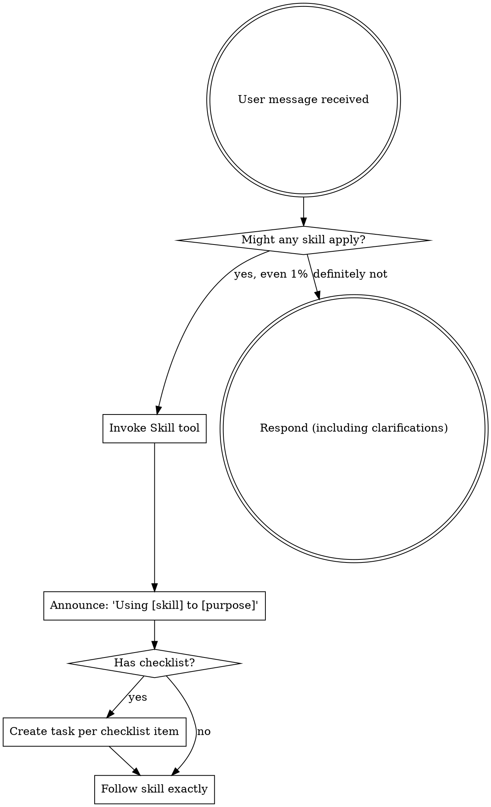

<EXTREMELY-IMPORTANT>
If you think there is even a 1% chance a skill might apply to what you are doing, you ABSOLUTELY MUST invoke the skill.

IF A SKILL APPLIES TO YOUR TASK, YOU DO NOT HAVE A CHOICE. YOU MUST USE IT.

This is not negotiable. This is not optional. You cannot rationalize your way out of this.
</EXTREMELY-IMPORTANT>

## How to Access Skills

**In Claude Code:** Use the `Skill` tool. When you invoke a skill, its content is loaded and presented to you—follow it directly. Never use the Read tool on skill files.

**In other environments:** Check your platform's documentation for how skills are loaded.

# Using Skills

## The Rule

**Invoke relevant or requested skills BEFORE any response or action.** Even a 1% chance a skill might apply means that you should invoke the skill to check. If an invoked skill turns out to be wrong for the situation, you don't need to use it.

```dot
digraph skill_flow {
    "User message received" [shape=doublecircle];
    "Might any skill apply?" [shape=diamond];
    "Invoke Skill tool" [shape=box];
    "Announce: 'Using [skill] to [purpose]'" [shape=box];
    "Has checklist?" [shape=diamond];
    "Create task per checklist item" [shape=box];
    "Follow skill exactly" [shape=box];
    "Respond (including clarifications)" [shape=doublecircle];

    "User message received" -> "Might any skill apply?";
    "Might any skill apply?" -> "Invoke Skill tool" [label="yes, even 1%"];
    "Might any skill apply?" -> "Respond (including clarifications)" [label="definitely not"];
    "Invoke Skill tool" -> "Announce: 'Using [skill] to [purpose]'";
    "Announce: 'Using [skill] to [purpose]'" -> "Has checklist?";
    "Has checklist?" -> "Create task per checklist item" [label="yes"];
    "Has checklist?" -> "Follow skill exactly" [label="no"];
    "Create task per checklist item" -> "Follow skill exactly";
}
```

## Lifecycle Map — work → skill

Find the work, invoke the skill. **Dispatch tier matters:**

- **(auto)** — dual/library skills you invoke directly with the `Skill` tool, or that other skills call.
- **(user runs)** — user-only leaves (`disable-model-invocation: true`). You **cannot** invoke or dispatch these; they are invisible to you at call time. When one fits, **recommend the slash command and let the user run it**. They are heavyweight or high-blast-radius (swarms, full PRD generation, autonomous loops, outward-facing deploy) on purpose.

### Define / Discover
| Work | Skill |
|------|-------|
| Generate a PRD/specs from scratch | `/groundwork:design-product` (user runs) |
| Clarify or stress-test a feature request | `understanding-feature-requests` (auto) |
| Design or reverse-engineer UX | `/groundwork:ux-design`, `/groundwork:source-ux-design-from-code` (user runs) |
| Reverse-engineer specs/architecture from existing code | `/groundwork:source-product-specs-from-code`, `/groundwork:source-architecture-from-code` (user runs) |
| Build/maintain the domain glossary | `domain-modeling` (auto) |

### Plan / Architect
| Work | Skill |
|------|-------|
| Translate PRD into architecture | `design-architecture` (auto) |
| Adversarial tech comparison across options | `/groundwork:swarm-design-architecture` (user runs) |
| Design a non-trivial module / interface / API | `design-it-twice` (auto) |
| Record a hard-to-reverse decision | captured in `design-architecture` (auto) |
| Break specs into tasks | `/groundwork:create-tasks` (user runs) |
| Plan a single task | `plan-task` (auto) |
| Verify task list covers the PRD | `task-validation-loop` (auto) |
| Check code ↔ spec alignment | `check-specs-alignment` (auto) |
| Convert single-file spec/arch to directory | `split-specs`, `split-architecture` (auto) |

### Build
| Work | Skill |
|------|-------|
| Execute task N / the next task | `work-on`, `work-on-next-task` (auto) |
| Implement a planned task in isolation | `implement-task` (auto) |
| Build without a task / autonomously | `/groundwork:build-unplanned`, `/groundwork:just-do-it`, `/groundwork:just-do-it-swarming` (user runs) |
| Write any feature or bugfix | `test-driven-development` (auto) |
| Ship thin slices behind a flag | `vertical-slice` (auto) |
| Pressure-test a high-stakes/irreversible decision | `doubt-driven-development` (auto) |
| Isolate work in a worktree | `use-git-worktree` (auto) |

### Verify / Review / Debug
| Work | Skill |
|------|-------|
| Local multi-agent validation + autofix | `validate` (auto) |
| Review a GitHub PR | `/groundwork:review-pr` (user runs) |
| Investigate a bug systematically | `debug` (auto), `/groundwork:swarm-debug` (user runs) |

### Ship
| Work | Skill |
|------|-------|
| Orchestrate the ship phase | `/groundwork:ship` (user runs) |
| Add logging/metrics/traces | `instrument-observability` (auto) |
| Roll out behind a flag in stages | `staged-rollout` (auto) |

### Meta / Project
| Work | Skill |
|------|-------|
| Configure repo / switch project | `setup-repo`, `select-project` (auto) |
| Hand off work to another session | `handoff` (auto) |
| List skills / health-check the plugin | `/groundwork:groundwork-help`, `/groundwork:groundwork-check` (user runs) |

## Red Flags

These thoughts mean STOP—you're rationalizing:

| Thought | Reality |
|---------|---------|
| "This is just a simple question" | Questions are tasks. Check for skills. |
| "I need more context first" | Skill check comes BEFORE clarifying questions. |
| "Let me explore the codebase first" | Skills tell you HOW to explore. Check first. |
| "I can check git/files quickly" | Files lack conversation context. Check for skills. |
| "Let me gather information first" | Skills tell you HOW to gather information. |
| "This doesn't need a formal skill" | If a skill exists, use it. |
| "I remember this skill" | Skills evolve. Read current version. |
| "This doesn't count as a task" | Action = task. Check for skills. |
| "The skill is overkill" | Simple things become complex. Use it. |
| "I'll just do this one thing first" | Check BEFORE doing anything. |
| "This feels productive" | Undisciplined action wastes time. Skills prevent this. |
| "I know what that means" | Knowing the concept ≠ using the skill. Invoke it. |
| "I'll just start working on the task" | Task execution REQUIRES the work-on skill. Invoke it first. |
| "Let me implement this task" | Always invoke work-on skill - it handles worktree isolation. |

## Skill Priority

When multiple skills could apply, use this order:

1. **Process skills first** (design-product, design-architecture) - these determine HOW to approach the task
2. **Implementation skills second** (tasks, test-driven-development) - these guide execution

"Let's build X" -> design-product first, then implementation skills.

## Skill Types

**Rigid**: follow exactly, don't adapt away discipline

**Flexible**: adapt principles to context.

The skill itself tells you which type it is.

## Monorepo Awareness

When working in a monorepo (`.groundwork.yml` exists):
- **Always check project context** before reading/writing specs
- If `{{project_name}}` is empty, prompt the user to select a project
- All `{{specs_dir}}/` paths resolve to the selected project's specs directory
- Use `/groundwork:select-project` to switch between projects
- Use `/groundwork:setup-repo` to configure the repo structure

## User Instructions

Instructions say WHAT, not HOW. "Add X" or "Fix Y" doesn't mean skip workflows.
